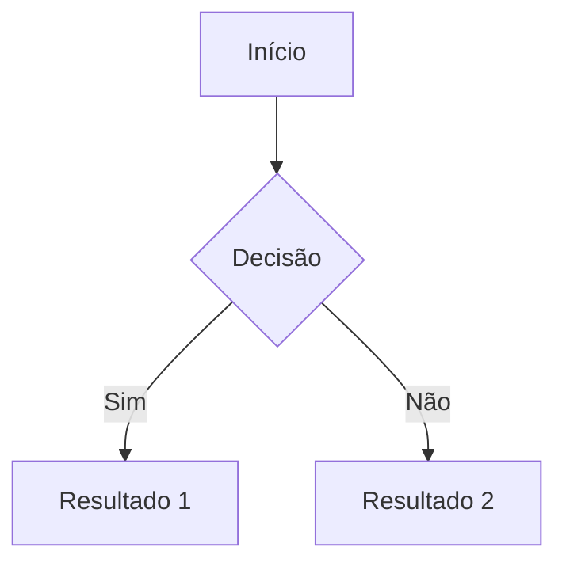

# MARKDOWN.md — Padrões de Markdown do Foxi Astro Theme

> Fonte única de verdade para formatação, linting e boas práticas de arquivos `.md` neste projeto.
> Todo arquivo `.md` criado ou modificado **deve** obedecer às regras definidas aqui.

---

## Ferramentas

Este projeto usa [markdownlint](https://github.com/DavidAnson/markdownlint) como motor de linting. Instale via:

```bash
npm install -g markdownlint-cli
```

Execute contra todos os arquivos Markdown:

```bash
markdownlint "**/*.md" --ignore node_modules --ignore .git
```

A configuração canônica fica em `.markdownlint.json` na raiz do projeto. Cada regra abaixo mapeia diretamente a um ID de regra do markdownlint.

---

## Configuração — `.markdownlint.json`

```json
{
  "default": true,
  "MD001": true,
  "MD003": { "style": "atx" },
  "MD004": { "style": "dash" },
  "MD009": true,
  "MD010": true,
  "MD012": { "maximum": 1 },
  "MD013": false,
  "MD022": true,
  "MD023": true,
  "MD024": false,
  "MD025": true,
  "MD031": true,
  "MD032": true,
  "MD033": true,
  "MD034": true,
  "MD040": true,
  "MD041": false,
  "MD047": true,
  "MD049": { "style": "asterisk" },
  "MD050": { "style": "asterisk" }
}
```

---

## Regras

### MD001 — Hierarquia de headings sem pulos

Headings só podem incrementar um nível por vez. Nunca pular de H1 para H3.

**Errado:**

```markdown
# Título

### Seção
```

**Correto:**

```markdown
# Título

## Seção

### Subseção
```

---

### MD003 — Estilo ATX para headings

Use sempre o estilo ATX (prefixo `#`). Nunca use sublinhados no estilo setext.

**Errado:**

```markdown
Título
======

Seção
-----
```

**Correto:**

```markdown
# Título

## Seção
```

---

### MD004 — Listas não ordenadas com hífen

Use `-` como marcador de lista. Nunca use `*` ou `+`.

**Errado:**

```markdown
* Item um
+ Item dois
```

**Correto:**

```markdown
- Item um
- Item dois
```

---

### MD009 — Sem espaços no final das linhas

Linhas não podem terminar com espaço em branco. Remova todos os espaços finais antes de salvar.

---

### MD010 — Sem tabs

Use espaços para indentação. Nunca use caracteres de tab em arquivos Markdown.

---

### MD012 — No máximo uma linha em branco consecutiva

Nunca deixe duas ou mais linhas em branco seguidas.

**Errado:**

```markdown
Parágrafo um.


Parágrafo dois.
```

**Correto:**

```markdown
Parágrafo um.

Parágrafo dois.
```

---

### MD013 — Comprimento de linha (desativado)

O comprimento de linha **não é limitado** neste projeto. Escreva na extensão que favorecer a leitura.

---

### MD022 — Linha em branco antes e depois de headings

Todo heading deve ter exatamente uma linha em branco antes e uma depois.

**Errado:**

```markdown
## Seção Um
Conteúdo aqui.
## Seção Dois
```

**Correto:**

```markdown
## Seção Um

Conteúdo aqui.

## Seção Dois
```

---

### MD023 — Headings na margem esquerda

Headings nunca podem ser indentados. Devem começar na coluna 1.

**Errado:**

```markdown
  ## Heading Indentado
```

**Correto:**

```markdown
## Heading na Margem
```

---

### MD024 — Headings duplicados (desativado)

Esta regra está desativada. Múltiplos headings com texto idêntico são permitidos.

---

### MD025 — Apenas um H1 por arquivo

Cada arquivo deve ter exatamente um heading de nível 1. Não repita H1.

---

### MD031 — Linha em branco antes e depois de blocos de código

Blocos de código delimitados por ` ``` ` devem ter uma linha em branco antes e depois.

**Errado:**

````markdown
Algum texto.
```bash
echo olá
```
Mais texto.
````

**Correto:**

````markdown
Algum texto.

```bash
echo olá
```

Mais texto.
````

---

### MD032 — Linha em branco antes e depois de listas

Listas devem ser precedidas e seguidas de exatamente uma linha em branco.

**Errado:**

```markdown
Texto introdutório.
- Item um
- Item dois
Texto seguinte.
```

**Correto:**

```markdown
Texto introdutório.

- Item um
- Item dois

Texto seguinte.
```

---

### MD033 — Sem HTML inline

Não use tags HTML dentro de arquivos Markdown. Use os equivalentes nativos:

| Em vez de | Use |
| --- | --- |
| `<br>` | Linha em branco ou dois espaços no final |
| `<b>texto</b>` | `**texto**` |
| `<i>texto</i>` | `*texto*` |
| `<code>texto</code>` | `` `texto` `` |
| `<hr>` | `---` |

---

### MD034 — Sem URLs nuas

Envolva todas as URLs em sintaxe de link. URLs soltas são proibidas.

**Errado:**

```markdown
Acesse https://foxi.com.br para mais informações.
```

**Correto:**

```markdown
Acesse [foxi.com.br](https://foxi.com.br) para mais informações.
```

---

### MD040 — Blocos de código com identificador de linguagem

Todo bloco de código delimitado deve incluir um identificador de linguagem para syntax highlighting.

**Errado:**

````markdown
```
npm install
```
````

**Correto:**

````markdown
```bash
npm install
```
````

Identificadores usados neste projeto:

| Linguagem | Identificador |
| --- | --- |
| Shell / Bash | `bash` |
| JavaScript | `js` |
| TypeScript | `ts` |
| Astro | `astro` |
| CSS | `css` |
| JSON | `json` |
| Markdown | `markdown` |
| Saída de terminal | `text` |
| YAML | `yaml` |
| HTML | `html` |
| Mermaid | `mermaid` |

---

## Diagramas e Fluxos

Para documentar arquiteturas, fluxos de dados ou estados complexos, use **Mermaid.js**.

````markdown

````

---

### MD041 — Primeira linha deve ser H1 (desativado)

Esta regra está desativada. Arquivos podem começar com frontmatter ou outro conteúdo.

---

### MD047 — Arquivo deve terminar com uma única linha em branco

Todo arquivo Markdown deve terminar com exatamente um caractere de nova linha. Não deixe múltiplas linhas em branco no final.

---

### MD049 / MD050 — Ênfase e negrito com asterisco

Use `*texto*` para itálico e `**texto**` para negrito. Nunca use underscores.

**Errado:**

```markdown
_itálico_ e __negrito__
```

**Correto:**

```markdown
*itálico* e **negrito**
```

---

## Tabelas

Tabelas devem seguir estas exigências:

1. Sempre incluir linha de cabeçalho e linha separadora.
2. A linha separadora usa `---` (mínimo três traços) em cada coluna.
3. Colunas alinhadas com pipes `|` para legibilidade no formato bruto.
4. **Espaço obrigatório**: Deve haver exatamente um espaço em branco de cada lado do conteúdo de cada célula (regra MD060).

**Exemplo correto:**

```markdown
| Ferramenta | Finalidade | Versão |
| --- | --- | --- |
| Astro | Framework web | 5.x |
| Tailwind CSS | Utilitários CSS | 3.x |
| markdownlint | Linting de Markdown | latest |
```

---

### MD026 — Sem pontuação final em headings

Headings não devem terminar com pontuação (ponto final, dois pontos, exclamação, etc.).

**Errado:**

```markdown
## Introdução:
```

**Correto:**

```markdown
## Introdução
```

---

### MD029 — Prefixos de listas ordenadas

Listas ordenadas devem usar numeração sequencial (1, 2, 3...).

**Errado:**

```markdown
1. Primeiro item
1. Segundo item
```

**Correto:**

```markdown
1. Primeiro item
2. Segundo item
```

---

### MD036 — Sem ênfase como heading

Não use negrito ou itálico em uma linha isolada para simular um heading. Use a sintaxe de heading real (`#`).

**Errado:**

```markdown
**Seção Importante**

Conteúdo...
```

**Correto:**

```markdown
### Seção Importante

Conteúdo...
```

---

## Links Relativos

Ao referenciar outros arquivos do projeto, use caminhos relativos e verifique que o arquivo de destino existe.

**Exemplo** — de `CLAUDE.md` apontando para o design system:

```markdown
Consulte o [DESIGN.md](./DESIGN.md) para referência visual completa.
```

---

## Frontmatter em Coleções de Conteúdo

Arquivos `.md` dentro de `src/content/` fazem parte das coleções do Astro e possuem frontmatter obrigatório. O frontmatter não é Markdown e não está sujeito às regras de linting acima, mas deve seguir o schema definido para cada coleção.

### Changelog (`src/content/changelog/`)

```markdown
---
title: "vX.Y.Z: Título Curto e Descritivo"
description: "Descrição SEO entre 100 e 200 caracteres."
date: "AAAA-MM-DD"
category: "Categoria"
tags: ["tag1", "tag2"]
---
```

Categorias válidas: `Lançamento`, `Funcionalidade`, `Correção`, `Performance`, `Segurança`, `Infraestrutura`, `Componentes`, `Conteúdo`, `API`, `Documentação`.

### Blog (`src/content/blog/`)

```markdown
---
title: "Título do Post"
description: "Descrição SEO do post."
pubDate: "AAAA-MM-DD"
author: "Nome do Autor"
image: "/images/blog/nome-da-imagem.webp"
tags: ["tag1", "tag2"]
---
```

### Podcast (`src/content/podcast/`)

```markdown
---
title: "Título do Episódio"
description: "Descrição do episódio."
pubDate: "AAAA-MM-DD"
duration: "HH:MM:SS"
audioUrl: "https://url-do-audio.mp3"
tags: ["tag1", "tag2"]
---
```

---

## Convenção de Cabeçalho para Documentos Raiz

Arquivos de documentação na raiz do projeto (`CLAUDE.md`, `GEMINI.md`, `DESIGN.md`, `MARKDOWN.md`, `README.md`) devem começar com um H1 e, quando aplicável, um blockquote descritivo:

```markdown
# Título do Documento

> Descrição curta da finalidade deste arquivo.
```

---

## Idioma

Todo o conteúdo dos arquivos Markdown deste projeto deve estar em **Português do Brasil (pt-BR)**, incluindo:

- Texto de parágrafos e listas
- Conteúdo de changelog, blog e podcast
- Comentários e notas de documentação

Termos técnicos (ex: *frontmatter*, *props*, *layout*, *slug*, *build*) permanecem em inglês.

---

## Aplicação

A skill `/markdown-format` (Claude Code) e `markdown-format` (Gemini CLI) são os aplicadores automatizados de todas as regras definidas aqui. Devem ser invocadas ao final de qualquer tarefa que crie ou modifique arquivos `.md`.

Qualquer pipeline de CI ou hook de pre-commit que execute `markdownlint` neste projeto usa `.markdownlint.json` como fonte de configuração, que corresponde diretamente às regras deste documento.
